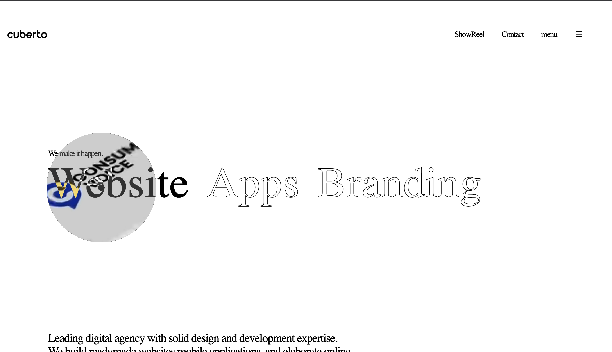
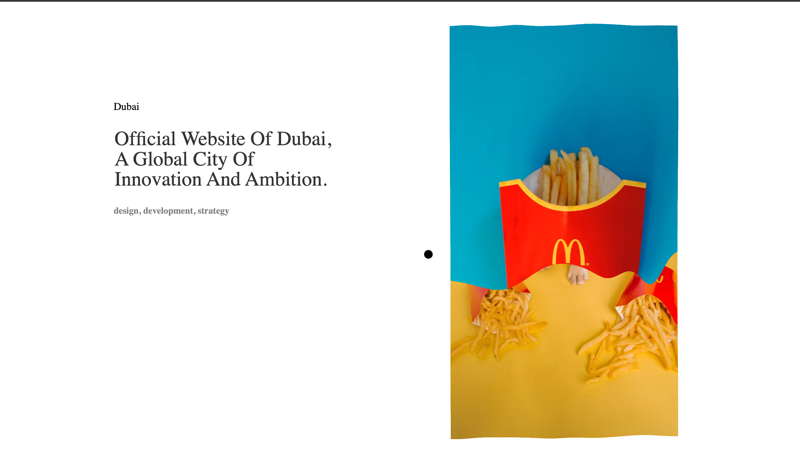

# 🎨 Digital Agency Website (Cuberto-Inspired)

An interactive, animation-heavy landing page for a digital agency, inspired by the design of [Cuberto](https://cuberto.com/). It features a custom mouse follower, magnetic navigation, video-on-hover headings, scroll-pinned project showcases with WebGL image distortion, and a responsive contact/footer section.

> Built as a personal front-end project while learning advanced web animation as a 3rd-year B.Tech CSE student. This is a learning/practice project and is not affiliated with Cuberto.

---

## 📸 Preview

<p align="center">
  
  
</p>

**Live demo:** (https://coffeewithjay.vercel.app/)

---

## ✨ Features

- **Custom mouse follower** – a smooth cursor that trails the pointer
- **Magnetic elements** – logo and menu icon are pulled toward the cursor on hover
- **Hover-with-video headings** – hovering "Website", "Apps" or "Branding" reveals a circular video preview following the cursor
- **Outline-to-fill text effect** – large stroked headings fill with colour on hover
- **Scroll-pinned featured projects** – the project list scrolls while the section stays pinned, driven by GSAP ScrollTrigger
- **WebGL image distortion** – project images transition using a Three.js-powered effect as you scroll
- **Design resources slider section** – card layout with course tags
- **Contact section and footer** – contact details, validated form and social links
- **Smooth in-page navigation** – nav links jump to the showreel and contact sections

---

## 🛠️ Tech Stack

| Technology | Purpose |
|------------|---------|
| HTML5 | Page structure |
| CSS3 | Layout, Flexbox, viewport-based typography, text-stroke effects |
| JavaScript (ES6) | Interaction logic |
| [GSAP](https://gsap.com/) + ScrollTrigger | Scroll-based animation and pinning |
| [SheryJS](https://shery.js.org/) | Mouse follower, magnet effect, media hover, image effects |
| [Three.js](https://threejs.org/) | WebGL rendering used by SheryJS image effects |
| [Font Awesome](https://fontawesome.com/) and [Remix Icon](https://remixicon.com/) | Icons |

---

## 📁 Project Structure

```
agency-website/
├── index.html                # Main page
├── style.css                 # Styles
├── script.js                 # GSAP, ScrollTrigger and SheryJS logic
├── 0.mp4, 2.mp4, 3.mp4       # Videos shown on heading hover
├── 01_azurio-main-image.jpg  # Course card image
├── pngtree-psd-templates-....jpg  # Course card image
└── README.md
```

---


## 📚 What I Learned

- Building scroll-driven animations and pinned sections with GSAP ScrollTrigger
- Using third-party animation libraries (SheryJS, Three.js) via CDN
- Creating responsive typography with viewport units (`vw`)
- Styling outlined text using `-webkit-text-stroke`
- Managing multiple CDN dependencies and debugging load-order issues

---

## 🔮 Future Improvements

- [ ] Make the layout fully responsive for tablets and phones
- [ ] Replace placeholder text, contact details and remote images with original content
- [ ] Add the "View all products" pages
- [ ] Add a page loader animation
- [ ] Optimise images and videos for faster load times
- [ ] Improve accessibility (alt text, keyboard focus, reduced-motion support)

---

## 🙏 Credits

- Design inspiration: [Cuberto](https://cuberto.com/)
- Animation libraries: [GSAP](https://gsap.com/), [SheryJS](https://shery.js.org/), [Three.js](https://threejs.org/)
- Placeholder images: [Unsplash](https://unsplash.com/) and template previews (Azurio, PngTree). Replace these with your own assets before using the site commercially.

---

## 📬 Contact

**Your Name** – 3rd Year CSE Student
- GitHub: [@your-username]( @hyphe_jayy)
- LinkedIn:  (https://www.linkedin.com/in/jairaj-singh-863aa0406/)
- Email: (jayrajsingh837@gamil.com)

